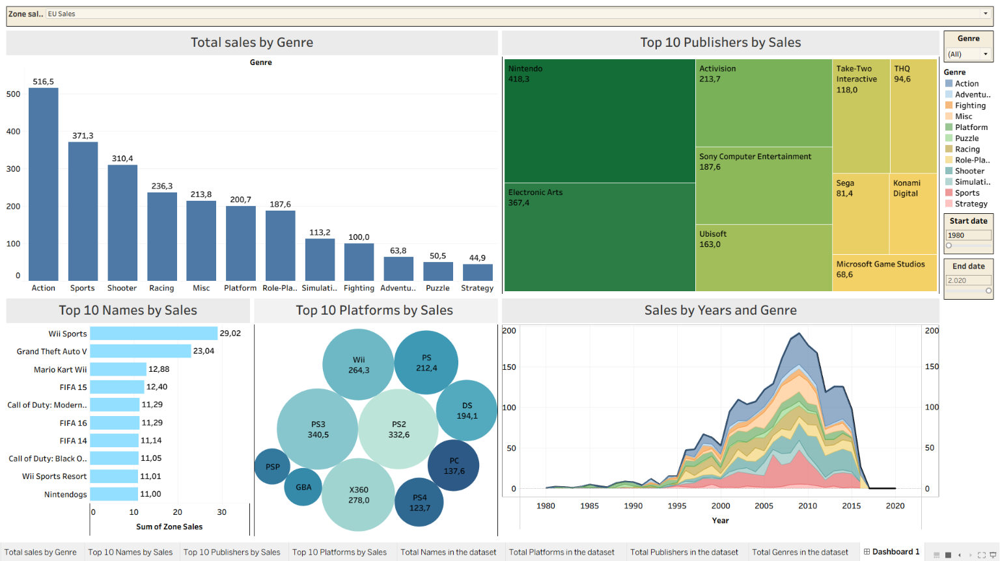

# 🎮 Video Game Sales Analysis - Tableau

*A Tableau Data Visualization Project*

---

## 📌 Project Overview

This project analyzes global video game sales from 1980 to 2020 using a Kaggle dataset of over 16,000 titles. The goal is to uncover market trends, identify top-performing publishers and platforms, and reveal regional consumer preferences. The interactive Tableau dashboard allows users to explore sales data by genre, platform, publisher, region, and time period — demonstrating skills in data visualization, storytelling, and deriving business insights.

---

## 🎯 Objectives

- Identify the best-selling genres and how they vary by region
- Determine the top 10 publishers and analyze their market dominance
- Visualize sales trends over time and detect market peaks
- Highlight regional differences in consumer behavior (Japan vs. Global)
- Provide an interactive tool for stakeholders to explore the data dynamically

---

## 📊 Dataset

| Attribute | Details |
|-----------|---------|
| **Source** | [Kaggle – Video Game Sales](https://www.kaggle.com/datasets/gregorut/videogamesales) |
| **License** | CC0: Public Domain |
| **Records** | 16,598 rows |
| **Columns** | 11 (Rank, Name, Platform, Year, Genre, Publisher, NA_Sales, EU_Sales, JP_Sales, Other_Sales, Global_Sales) |
| **Time Period** | 1980–2020 |

> The dataset is included in the `data/` folder for reproducibility.

---

## 🔍 Key Insights

> *All insights are derived from the interactive Tableau dashboard and supported by the visualizations below.*

### 1. 🌏 A Tale of Two Markets: The Cultural Rift in Global Gaming

The data reveals a stark polarization in consumer tastes between Japan and Western markets. Globally, **Action** leads with 1,723M units sold, followed by Sports (1,309M) and Shooter (1,026M). In Japan, however, **Role-Playing** dominates with 350.3M units — more than double the next genre. This divide is crystallized at the game level: global chart-toppers *Wii Sports* (82.74M) and *GTA V* (55.92M) are replaced in Japan by *Pokémon Red/Blue* (10.2M) and *Pokémon Gold/Silver* (7.2M). A one-size-fits-all publishing strategy is bound to fail.

### 2. 🔫 The Shooter Genre's "Bamboo Curtain"

The Shooter genre — a solid top-3 performer in North America, Europe, and globally — faces a near-impenetrable cultural barrier in Japan. It plummets to **12th place** with only 11.2M units sold. This represents the most extreme regional preference gap in the dataset, demonstrating how cultural factors can lock out even the industry's most lucrative genres.

### 3. 🏰 Nintendo's Unshakeable Ecosystem

Nintendo leads all publishers with 1,784M units sold globally, outpacing Electronic Arts. Their dominance is driven by a self-reinforcing ecosystem: top-selling platforms (**DS**, **Wii**) host top-selling first-party titles (*Wii Sports*, *Pokémon*). The sole exception is the fragmented `Other Sales` region, where EA's diversified multi-platform portfolio gives it a slight edge — proving the value of both walled-garden and broad-publishing strategies.

### 4. 🎮 The Handheld Haven: Japan's Platform Power Shift

Globally, the **PlayStation 2** reigns supreme (1,233.5M units), with the Wii, Xbox 360, and PS3 all above 900M. In Japan, the hierarchy shifts dramatically: the **Nintendo DS** claims the top spot (175M), reflecting a deep cultural preference for portable gaming. This aligns with the success of handheld RPGs and social-gaming phenomena unique to the Japanese market.

### 5. 📆 De-synchronized Market Peaks

The global gaming industry peaked between **2007–2009**, fueled by the mass adoption of the Wii, PS3, and Xbox 360. Japan, however, operates on its own timeline, with distinct peaks in **1996** (Nintendo 64, PlayStation launch, Pokémon-fueled Game Boy boom) and **2006** (DS/PSP handheld era). This suggests Western markets move to blockbuster console cycles, while Japan's market reacts more strongly to domestic hardware innovation — especially in portables.

---

## 📈 Interactive Dashboard

### 🔧 Dashboard Features

| Feature | Description |
|---------|-------------|
| **Bar Chart** | Total Sales by Genre (sorted descending) |
| **Heat Map** | Top 10 Publishers by Sales |
| **Stacked Bar Chart** | Top 10 Game Titles by Sales |
| **Bubble Chart** | Top 10 Platforms by Sales |
| **Area Chart** | Sales by Year and Genre (trend over time) |
| **Parameters** | Adjustable `Start Date` & `End Date` (1980–2020) |
| **Region Slicer** | Toggle between Global, NA, EU, JP, Other Sales |

> 📥 **Download the Tableau workbook:** [`tableau/ProjectVGsale.twbx`](tableau/ProjectVGsale.twbx)
>
> *(Open with Tableau Desktop or Tableau Reader for full interactivity)*
> or [Tableau Public](https://public.tableau.com/app/profile/khanh.vu7737/viz/ProjectVGsale/Dashboard1?publish=yes)
---

## ⚙️ Tools & Skills Demonstrated

| Skill | Tool / Technique |
|-------|------------------|
| **Data Visualization** | Tableau Desktop (bar chart, heat map, stacked bar, bubble chart, area chart) |
| **Dashboard Interactivity** | Parameters (date range), Slicers (region toggle), Dynamic filtering |
| **Analytical Thinking** | Cross-regional comparison, Trend analysis, Genre/platform ecosystem mapping |
| **Data Storytelling** | Translating raw numbers into 5 actionable business insights |
| **Portfolio Presentation** | Professional README, Animated GIF preview, Structured file organization |

---

## 🚀 How to Use

1. **Explore the dashboard preview** — static image & GIF above provide quick overview
2. **For full interactivity** — download `tableau/ProjectVGsale.twbx` and open with [Tableau Desktop](https://www.tableau.com/products/desktop) or free [Tableau Reader](https://www.tableau.com/products/reader)
3. Or open on Browser [Tableau Public](https://public.tableau.com/app/profile/khanh.vu7737/viz/ProjectVGsale/Dashboard1?publish=yes)
4. **Experiment with filters:**
   - Adjust the date range (1980–2020) to focus on specific eras
   - Toggle between regions (Global, NA, EU, JP, Other) to see how rankings shift
   - Hover over elements for detailed tooltip data

---

## 📬 Contact

| Channel | Link |
|---------|------|
| **GitHub** | [https://github.com/toilakhanh123123] |
| **LinkedIn** | [https://www.linkedin.com/in/khánh-vũ-027020287/] |
| **Email** | [khanct2004@gmail.com] |

---

> *This project is part of my Data Analyst portfolio, showcasing my ability to transform raw data into clear visualizations and actionable business insights.*
